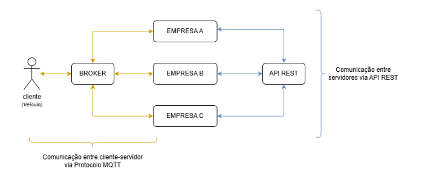
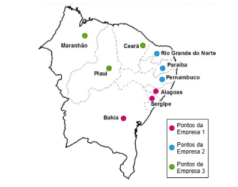

  
<h1> Sistema de Recarga Distribuida de Veiculos Elétricos </h1>
 

 
  
  

 

 Este projeto tem como objetivo desenvolver um sistema inteligente de recarga distribuída para veículos elétricos, focado no planejamento e na reserva antecipada de múltiplos pontos de carregamento ao longo de rotas previamente definidas. A implementação utilizou contêineres Docker para orquestração, APIs REST para a comunicação entre os servidores e o protocolo MQTT para a interação entre cliente e servidores. Os testes foram conduzidos com dados simulados, representando diferentes padrões de consumo de bateria. 

## Sumário 📖

- [Introdução](#introdução)
- [Fundamentos Teóricos](#fundamentos-teóricos)
- [Arquitetura do Sistema](#arquitetura-do-sistema)
- [Protocolo de Comunicação](#protocolo-de-comunicação)
- [Fluxo de Comunicação](#fluxo-de-comunicação)
- [Gerenciamento de Concorrência](#gerenciamento-de-concorrência)
- [Como Executar](#como-executar)
- [Conclusão](#conclusão)
- [Referências](#referências)

## Introdução

A adoção de veículos elétricos (VEs) tem se intensificado como uma alternativa sustentável ao transporte convencional. Entretanto, a incerteza quanto à disponibilidade de pontos de recarga em viagens de longa distância ainda representa um obstáculo significativo, restringindo o uso de VEs em trajetos intermunicipais ou interestaduais. Este trabalho propõe o desenvolvimento de um sistema de recarga distribuída, capaz de planejar e reservar previamente múltiplos pontos de carregamento ao longo de uma rota estabelecida.
O principal objetivo do sistema é assegurar que o usuário consiga concluir sua viagem com segurança, mesmo quando for necessário utilizar pontos de recarga pertencentes a diferentes empresas. Para isso, um dos maiores desafios é viabilizar uma comunicação eficiente e confiável entre servidores localizados em diferentes empresas e regiões geográficas, de modo que a reserva dos pontos possa ser realizada por meio de uma requisição atômica — ou seja, totalmente bem-sucedida ou inteiramente rejeitada.
A solução foi com o uso de contêineres Docker, APIs REST para a comunicação entre os servidores e o protocolo MQTT para a interação entre cliente e servidores. Os testes serão realizados com dados simulados, representando diferentes padrões de autonomia de bateria dos veículos, permitindo avaliar o comportamento e a eficácia da aplicação desenvolvida. Este relatório descreve os conceitos abordados, as decisões de projeto tomadas e os resultados obtidos ao longo do desenvolvimento da solução.

## Fundamentos Teóricos

- **Linguagem GoLang**
A linguagem Go foi escolhida para este projeto por oferecer suporte nativo à concorrência com goroutines e canais, facilitando o gerenciamento paralelo de múltiplos veículos e pontos de recarga. Sua integração eficiente com APIs REST atende à necessidade de comunicação entre servidores distribuídos, utilizando protocolos HTTP de forma segura e performática. Além disso, a leveza dos binários compilados em Go favorece a criação de contêineres Docker otimizados, alinhando-se perfeitamente aos requisitos de distribuição e execução em ambientes isolados.

- **Docker**
Docker é uma plataforma que viabiliza a execução de aplicações em ambientes isolados e portáteis por meio de containers. No contexto deste projeto, seu uso foi fundamental para simular uma arquitetura distribuída com múltiplas instâncias, permitindo a criação de ambientes realistas e independentes. Isso contribuiu diretamente para a facilidade no desenvolvimento, na realização de testes e na apresentação do sistema, além de garantir maior confiabilidade e escalabilidade ao manter os componentes desacoplados.

- **Sistemas Distribuídos**
Sistemas distribuídos são compostos por múltiplos nós autônomos que se comunicam por rede para atuar de forma coordenada, como um único sistema, mesmo estando fisicamente separados. Cada nó executa parte das tarefas globais, compartilhando recursos e responsabilidades, o que exige sincronização, consistência e tolerância a falhas. No projeto, essa arquitetura permitiu que servidores de diferentes empresas de recarga colaborassem de maneira integrada, viabilizando a reserva e o planejamento eficiente das rotas de veículos elétricos, mesmo operando como sistemas independentes.

- **Protocolo MQTT**
Neste projeto, o protocolo MQTT (Message Queuing Telemetry Transport) foi utilizado para a comunicação entre os veículos simulados e os servidores das empresas de recarga. Com base em um modelo publish/subscribe, o MQTT permite que os dispositivos se comuniquem de forma indireta por meio de um broker. Nele, os publicadores enviam mensagens para tópicos específicos sem conhecer os assinantes, enquanto os assinantes recebem automaticamente as mensagens dos tópicos de interesse. Esse desacoplamento entre remetente e receptor torna o sistema mais escalável, flexível e robusto — características essenciais para arquiteturas distribuídas como a proposta neste projeto.

- **Broker**
Um broker, ou intermediário de mensagens, é um componente de software responsável por gerenciar a troca de mensagens entre diferentes sistemas, aplicações ou serviços. Ele permite uma comunicação assíncrona e desacoplada, em que remetente e destinatário não precisam estar conectados simultaneamente nem conhecer detalhes um do outro. Essa abordagem torna o sistema mais flexível, escalável e resiliente.

- **API Rest**
Uma API REST (Representational State Transfer) é uma interface que define regras para a comunicação entre sistemas utilizando o protocolo HTTP. Ela facilita a integração entre aplicações ao permitir o compartilhamento de dados e funcionalidades de forma padronizada, leve e escalável. Muito utilizada em sistemas web, aplicativos móveis e serviços em nuvem, a API REST oferece uma maneira eficiente e consistente de acessar recursos e serviços disponibilizados por um servidor.

- **Protocolo HTTP**
O protocolo HTTP (HyperText Transfer Protocol) é a base da comunicação em APIs REST, definindo como as mensagens são trocadas entre cliente e servidor. Ele utiliza métodos padronizados para operar sobre recursos: **GET** para recuperar dados, **POST** para criar, **PUT** para atualizar totalmente, **PATCH** para atualizar parcialmente e **DELETE** para remover recursos. Cada recurso é acessado por uma URL única, com dados geralmente trocados em formato JSON. O HTTP também fornece códigos de status que indicam o resultado das requisições, facilitando o controle e a depuração das operações.

- **Requisição Atômica**
Requisições atômicas são operações indivisíveis que, ao serem executadas, devem ocorrer por completo ou não ocorrerem de forma alguma. Essa propriedade é essencial para garantir a consistência e integridade dos dados, especialmente em sistemas distribuídos, onde diferentes componentes podem acessar ou alterar os mesmos recursos simultaneamente.

## Arquitetura do Sistema

  

- **Componentes do Sistema**
O sistema foi estruturado em dois componentes principais: clientes e servidores das empresas. 
    - Os *clientes* representam os proprietários de veículos elétricos que desejam reservar diversos pontos de recarga ao longo de uma rota, comunicando-se com os servidores por meio do protocolo MQTT, via broker. 
    - Já os *servidores* correspondem às empresas responsáveis pela gestão dos pontos de recarga, cada um administrando seus próprios pontos. Para coordenar reservas que envolvem pontos pertencentes a outros servidores, a comunicação entre eles ocorre por meio de uma API REST utilizando o protocolo HTTP.

- **Escolha da Rota e Seleção dos Pontos de Recarga**
Por decisão do grupo, definimos nosso projeto como um sistema de reserva de pontos de recarga interestadual na região Nordeste. O usuário poderá escolher uma origem e um destino, ambos localizados entre os estados dessa região, e o sistema calculará a melhor rota possível para um carro elétrico. Além disso, o sistema selecionará os pontos de recarga necessários para completar o trajeto, considerando a distância a ser percorrida, a autonomia do veículo elétrico e a localização dos pontos de recarga ao longo do percurso. Para fins de simulação, estabelecemos que cada estado da região Nordeste possui um ponto de recarga.

- **Definição das Empresas e Pontos de Recargas**

  

Optamos por simular três servidores, representando três empresas distintas, cada uma operando em máquinas separadas. A comunicação entre esses servidores ocorre por meio de API REST. Considerando que a região Nordeste é composta por nove estados, e que cada estado possui um ponto de recarga, distribuímos os pontos de recarga entre as três empresas, de forma que cada uma fique responsável por três pontos.

- **Comunicação entre servidores**
A comunicação entre os servidores responsáveis pelos pontos de recarga foi implementada utilizando o padrão REST, permitindo a interoperabilidade entre sistemas independentes por meio de requisições HTTP. Cada servidor expõe endpoints como /api/reserva, /api/status e /api/cancelamento, os quais permitem operações como reserva, verificação de disponibilidade e cancelamento de pontos de recarga. As mensagens trocadas seguem o formato JSON, facilitando a serialização dos dados e sua leitura por sistemas distintos. A escolha pelo padrão REST possibilita uma integração padronizada e escalável entre diferentes empresas, atendendo ao requisito de coordenação descentralizada entre servidores, conforme proposto no problema. Além disso, o sistema trata respostas de forma síncrona, garantindo que uma reserva seja confirmada apenas se todos os pontos necessários forem reservados com sucesso em servidores distintos, assegurando a consistência do processo.

- **Fluxo de Comunicação**
O fluxo de comunicação do sistema é composto por dois canais principais: o protocolo MQTT, utilizado para interação entre cliente e servidor, e a API REST, empregada na comunicação entre servidores. Quando um cliente envia uma solicitação (como reserva, pré-reserva ou cancelamento), a mensagem é publicada via MQTT no tópico mensagens/cliente, contendo um código de operação, a placa do veículo e os pontos desejados. O servidor correspondente interpreta a mensagem e, caso os pontos solicitados pertençam a sua empresa, processa a requisição localmente. Para pontos de outras empresas, o servidor encaminha a solicitação via API REST para os demais servidores cadastrados. Cada servidor, por sua vez, verifica a disponibilidade local e responde com o status da operação. Apenas se todas as respostas forem positivas a reserva é efetivada, garantindo consistência. O servidor então envia uma resposta final ao cliente, também via MQTT. Esse fluxo híbrido e assíncrono permite escalabilidade, desacoplamento entre os componentes e tolerância a falhas em servidores individuais.

## Protocolo de Comunicação

O sistema desenvolvido faz uso de dois protocolos de comunicação principais: MQTT e HTTP. O protocolo MQTT (Message Queuing Telemetry Transport) é utilizado para a comunicação entre o cliente (veículo) e os servidores. Trata-se de um protocolo leve, baseado em publicações e assinaturas (publish/subscribe), ideal para dispositivos com recursos limitados e redes instáveis. Através dele, o cliente envia comandos como pré-reserva, confirmação, cancelamento e liberação de pontos, e recebe as respostas diretamente dos servidores, de forma assíncrona e em tempo real. Já o protocolo HTTP, seguindo o padrão RESTful, é empregado na comunicação entre os servidores, permitindo que requisitem uns aos outros ações como reserva e cancelamento de pontos pertencentes a diferentes empresas. Essa separação de responsabilidades entre os protocolos permite um sistema mais modular, eficiente e robusto, aproveitando os pontos fortes de cada tecnologia para atender aos diferentes requisitos de comunicação do projeto.

### Comunicação com cliente
A comunicação entre o cliente e os servidores é realizada por meio do protocolo MQTT, proporcionando um canal leve, assíncrono e eficiente para o envio de comandos e recebimento de respostas. O cliente publica mensagens no tópico mensagens/cliente contendo um código de operação (como pré-reserva, confirmação ou cancelamento), a placa do veículo e a lista de pontos desejados. Após o envio, o cliente se inscreve no tópico de resposta personalizado mensagens/cliente/{placa}, aguardando a confirmação do servidor. O tratamento das mensagens é feito de forma reativa: o cliente interpreta o conteúdo da resposta e exibe ao usuário mensagens apropriadas, como sucesso na reserva, falhas por indisponibilidade ou desconexão de pontos. Essa abordagem permite que o cliente opere com simplicidade, enquanto os servidores gerenciam a lógica complexa de distribuição e sincronização das reservas. Além disso, o cliente simula o comportamento real de um veículo elétrico, programando viagens, calculando autonomias e interagindo automaticamente com os servidores sempre que é necessária uma recarga durante o trajeto.

## Gerenciamento de Concorrência

Para garantir a integridade dos dados e evitar condições de corrida, o sistema utiliza mutexes da biblioteca `sync` em Go. Cada ponto de recarga possui um mutex próprio, armazenado no mapa `pontoLocks`, que controla o acesso exclusivo durante operações críticas como reservas e cancelamentos. Antes de modificar o estado de um ponto, o sistema aplica `lock` e, ao final, libera com `unlock`, prevenindo conflitos entre requisições simultâneas. Um mutex global, `reservasMutex`, também é usado para proteger o mapa geral de reservas, garantindo consistência nas operações compartilhadas entre os servidores.
O uso de mutexes por ponto individual (pontoLocks) é uma escolha eficiente, pois evita o bloqueio global desnecessário. Isso permite que múltiplas reservas sejam processadas simultaneamente desde que envolvam pontos diferentes, aumentando o desempenho e a escalabilidade do sistema.

## Como Executar

    1. Para buildar as imagens do projeto use:
        docker-compose build  
    2. Para criar os containers sem iniciar:
        docker-compose create 
    Obs. Use o comando: docker ps -a para verifica os containers criados;
    3. Para executar os containers, primeiro execute o service usando: 
        docker-compose start server1
    4. Mostrar os logs em tempo real de todos os containers:
        docker-compose logs -f
    5. Cada servidor pode ser rodado numa máquina, para isso, em cada máquina repita esses passos porém, alterando para server2 ou server3
    6. Para rodar o cliente:
        docker-compose start client
        docker exec -it client sh
        ./client
    Para facilitar o processo, podem ser usados os scripts

## Conclusão

O desenvolvimento deste sistema de recarga distribuída para veículos elétricos demonstrou a viabilidade de uma solução capaz de integrar múltiplos servidores de empresas distintas por meio de uma arquitetura distribuída, confiável e escalável. Combinando o protocolo MQTT para comunicação leve e assíncrona com os clientes, e API REST via HTTP para coordenação entre os servidores, foi possível garantir que todas as reservas fossem realizadas de forma atômica e segura, mesmo em um ambiente com múltiplos pontos de decisão. O uso da linguagem Go, com seu suporte nativo à concorrência, aliado à orquestração com Docker, permitiu simular um cenário realista com baixa complexidade operacional. Além disso, o sistema se mostrou resiliente ao tratar concorrência com mutexes por ponto e sincronização global nas reservas, evitando conflitos durante acessos simultâneos. Como resultado, foi entregue uma solução funcional, capaz de gerenciar reservas dinâmicas de recarga, garantindo segurança e praticidade ao usuário em viagens intermunicipais, reforçando a importância de sistemas inteligentes e distribuídos para a mobilidade elétrica do futuro.

## Equipe

<table>
  <tr>
    <td align="center"> <b> Helena Filemon </b></a> 👨‍💻</a></td>
    <td align="center"> <b> Sara Souza </b></a> 👨‍💻</a></td>
  </tr>
</table>

## Referências

GOLANG. The Go Programming Language Documentation. Disponível em: https://golang.org/doc/. 

ECLIPSE FOUNDATION. Paho MQTT Go Client – Package Documentation. Disponível em: https://pkg.go.dev/github.com/eclipse/paho.mqtt.golang. 

MOZILLA DEVELOPER NETWORK. Protocolo HTTP – Documentação MDN Web Docs. Disponível em: https://developer.mozilla.org/pt-BR/docs/Web/HTTP.

DOCKER INC. Docker Documentation. Disponível em: https://docs.docker.com/. 